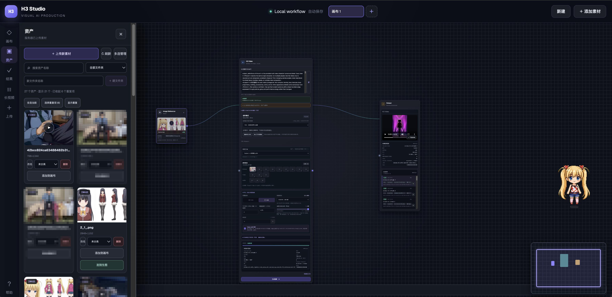
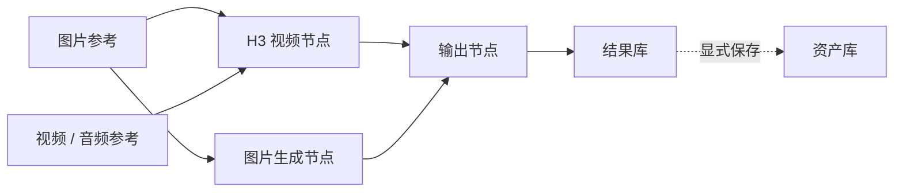
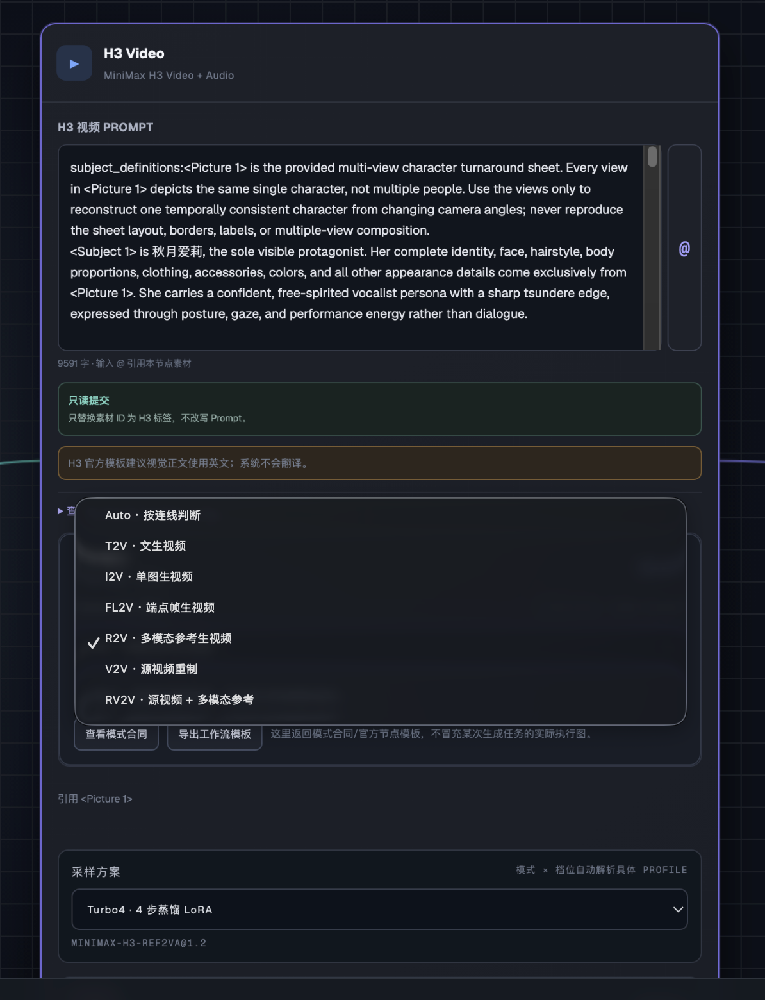
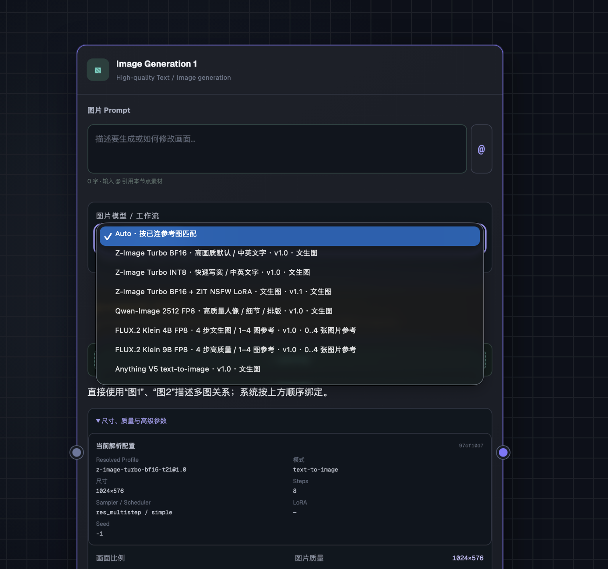
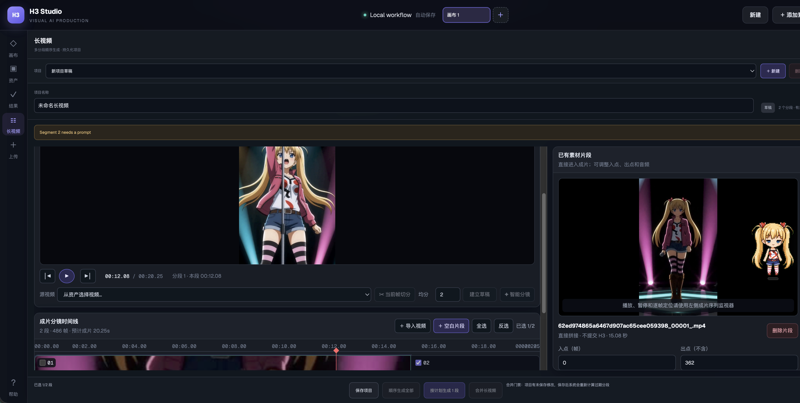
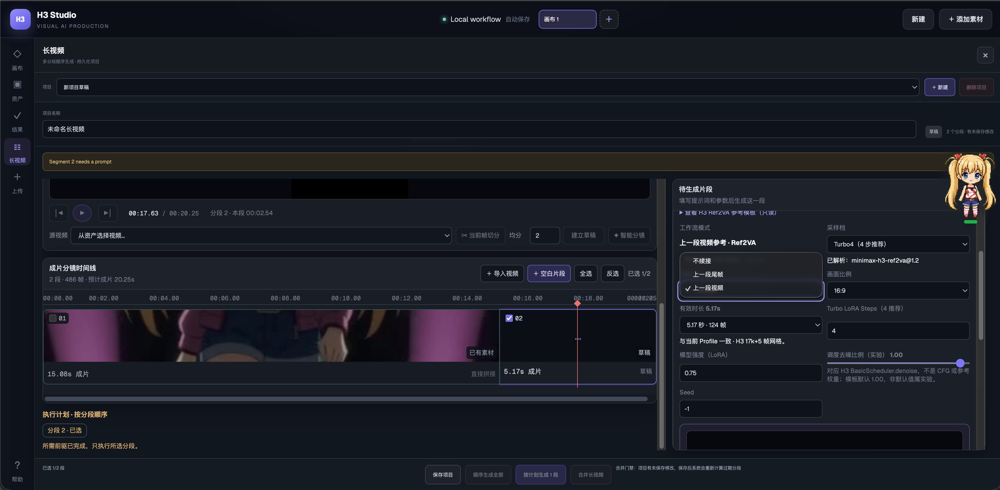
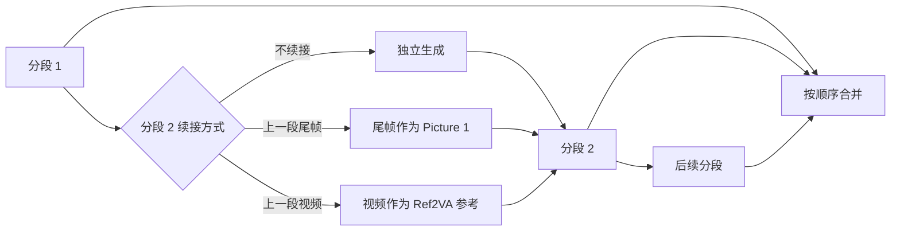

# H3 Studio

<p align="center">
  简体中文 · <a href="README.en.md">English</a> · <a href="README.ja.md">日本語</a>
</p>

<p align="center">
  <strong>面向本地与远程 ComfyUI 的节点式 MiniMax H3 视觉创作工作台</strong>
</p>

<p align="center">
  视频生成 · 图片生成与编辑 · 多模态参考 · 长视频分段续接 · 资产与结果管理
</p>

<p align="center">
  <a href="#三步启动">三步启动</a> ·
  <a href="docs/installation.md">完整安装指南</a> ·
  <a href="docs/h3-prompt-guide.md">H3 提示词指南</a> ·
  <a href="docs/long-video.md">长视频说明</a> ·
  <a href="docs/releasing.md">发布规范</a>
</p>

H3 Studio 把素材、提示词、模型参数与生成结果组织在一张可持久化画布中。浏览器负责节点编排、参考素材绑定、预览和项目管理；Python 服务负责安全上传、工作流编译、ComfyUI 队列、结果下载与恢复。画布会自动保存，可以同时维护多个独立工作流。

> 以下界面截图使用经用户授权公开的演示素材，仅用于说明功能；仓库不包含对应的原始素材、模型权重或生成视频文件。

<p align="center">
  
</p>



## 生成效果示例

下面的轻量动图截取自 H3 Studio 生成的 9:16、15.08 秒带音频演示视频，展示有效画面开始后的连续 5 秒。这里只公开无声动图示例，完整生成文件不进入代码仓库。

[](docs/assets/readme/generated-video-preview.gif?raw=1)

[动图未显示？点击这里直接打开原始 GIF。](docs/assets/readme/generated-video-preview.gif?raw=1)

## 核心能力

### 节点画布

- 在同一画布编排图片、视频、音频参考、H3 视频、生图和输出节点。
- 输入 `@` 引用当前节点素材；连接线与显式模式共同决定实际工作流。
- 图像、视频剪辑和抽帧会生成新的结果节点，不会自动进入资产库；需要复用时再从节点右键保存到资产。
- 本地图片、视频和音频可以拖入画布；节点内媒体不会被误判为本地上传。
- 画布、资产和任务状态都可刷新恢复，结果支持预览和下载。

### 七种视频创作模式

<p align="center">
  
</p>

| 模式 | 用途 | 输入约束 |
| --- | --- | --- |
| `Auto` | 根据节点连线自动选择工作流 | 适合快速编排 |
| `T2V` | 文生视频 | 只使用文本提示词 |
| `I2V` | 单图生视频 | 1 张起始参考图 |
| `FL2V` | 首尾帧生视频 | 1–2 张端点图 |
| `R2V` | 多模态参考生视频 | 图片、视频、音频合计最多 6 项 |
| `V2V` | 源视频重制 | 显式选择 1 条源视频 |
| `RV2V` | 源视频 + 多模态参考 | 源视频与额外参考分开绑定 |

H3 视频支持 16:9、9:16 和 24 FPS，时长使用真实的 `17k+5` 帧网格：124–362 帧，约 5.17–15.08 秒。采样可选择 Turbo LoRA 或官方基础 Profile；界面展示最终解析的模型、采样器、步数、LoRA 与调度参数，不把工作流预览冒充实际任务证据。

### 多模型生图与图像编辑

<p align="center">
  
</p>

| 模型 / 工作流 | 支持方式 | 适合场景 |
| --- | --- | --- |
| Z-Image Turbo BF16 / INT8 | 文生图、实验性单图 latent img2img | 快速写实、中英文字；BF16 为默认高画质档 |
| Z-Image Turbo + 社区 LoRA | 文生图、实验性单图 latent img2img | 独立 Profile，参数与模型绑定可审计 |
| Qwen-Image 2512 | 高质量文生图 | 人像、自然细节、图文排版 |
| Qwen-Image Edit 2511 | 单图指令编辑 | 保持主体并修改背景、服装或局部语义 |
| FLUX.2 Klein 4B / 9B | 文生图、1–4 张有序图片参考 | 多图人物、服装、场景和风格组合 |
| Anything V5 | Checkpoint 文生图 / 图生图 | 兼容回退 |

生图支持 1K/2K 与 16:9、9:16、3:4、1:1。可直接在提示词中用“图1”“图2”描述多图关系，系统按参考槽位顺序绑定。尚未发布的 Z-Image-Edit 只显示为不可用能力，不会用 latent img2img 冒充指令编辑。模型许可与精确工作流见 [图片工作流文档](docs/image-workflows.md)。

### 长视频：分段生成与续接

长视频工作区把现有视频和待生成片段放进统一时间线，可预览、切分、调整入出点、创建空白段，并按选中片段或依赖顺序执行。

<p align="center">
  
</p>

每个待生成片段都可以选择独立生成、使用上一段尾帧续接，或把上一段视频作为 Ref2VA 参考。续接配置、画面比例、有效时长、采样档、LoRA 强度与 Seed 都会随项目保存。

<p align="center">
  
</p>



- 单段支持约 5.17–15.08 秒，失败后可重跑，前序变化会使依赖的下游片段失效并重新计算。
- 362 帧成片作为下一段视频参考时，只裁剪系统派生的 15 秒参考副本；最终合并仍使用完整成片。
- 合并由 FFmpeg 做可审计的硬切拼接，不宣称自动实现无缝音画衔接。
- 支持停止任务、按计划生成、合并长视频和下载成片。完整合同见 [长视频文档](docs/long-video.md)。

### 资产与结果管理

- 资产库跨画布复用图片、视频和音频，支持搜索、文件夹、置顶、多选和批量删除。
- 文件夹删除只移除文件夹本身；其中的资产和子文件夹自动移动到上一级，不会误删媒体。
- 结果库统一展示生成结果与剪辑派生结果，支持置顶、混合多选、全选当前项、批量删除、预览和下载。
- 同内容素材按 SHA-256 复用并折叠展示，减少重复上传与存储占用。

仓库同时附带一个本地 H3 提示词编译 skill，入口见 [`skills/h3-ref2va-prompt-compiler`](skills/h3-ref2va-prompt-compiler/SKILL.md)。

## 三步启动

> [!IMPORTANT]
> 一键脚本可以安装项目的锁定 Node 依赖、构建前端并启动服务，但不会代替系统安装 Python、Node.js、FFmpeg、ComfyUI、自定义节点或模型。新机器请先看 [完整安装与运行指南](docs/installation.md)。

环境要求：

- Node.js `>=22.13`
- Python `>=3.11`
- npm、`ffmpeg` 与 `ffprobe`
- 可访问的 ComfyUI，以及所选 Profile 需要的节点和模型
- 可选 `scenedetect>=0.6.4,<0.8`；未安装时智能分镜自动回退到 FFmpeg

在项目根目录执行：

1. 复制配置，确认 ComfyUI URL、数据目录和模型文件名，并把示例 API Key 改成强随机值。

   ```bash
   cp .env.example .env.local
   # 用编辑器修改 .env.local
   ```

2. 安装锁定的 Node 依赖并生成生产构建。

   ```bash
   python3 scripts/h3studio.py install
   ```

3. 检查依赖与 ComfyUI，然后启动 API 和生产前端。

   ```bash
   python3 scripts/h3studio.py doctor --check-comfy
   python3 scripts/h3studio.py start
   ```

打开 `http://127.0.0.1:3013`。`start` 会监督前后端进程；任一进程退出时会停止另一进程，按 `Ctrl-C` 即可完整关闭。

### 管理命令

```bash
# 只检查，不修改系统
python3 scripts/h3studio.py doctor

# 只显示将执行的安装或启动命令
python3 scripts/h3studio.py install --dry-run
python3 scripts/h3studio.py start --dry-run

# 自定义端口；三个端口必须不同
python3 scripts/h3studio.py start --port 3013 --internal-port 3014 --api-port 6020
```

`doctor` 会检查 Python、Node.js、npm、FFmpeg/FFprobe、项目文件、前端依赖/构建和密钥接线；`--check-comfy` 另检查 ComfyUI `/system_stats`。它不会下载依赖，也不能证明所有 Profile 的节点和模型已经齐全；启动后请以 `/api/capabilities` 和界面的可用性提示为准。等价 npm 命令为 `npm run doctor`、`npm run install:studio` 和 `npm run start:studio`。

## 本地开发

```bash
npm ci
cp .env.example .env.local

# 终端 A：API
set -a && source .env.local && set +a
python3 -m server

# 终端 B：前端；/api 代理到 6020
set -a && source .env.local && set +a
npm run dev -- --host 127.0.0.1 --port 3013
```

如果启用了 API Key，只把同一个值放进服务端的 `H3_STUDIO_API_KEY` 与前端代理进程的 `H3_STUDIO_PROXY_API_KEY`；密钥不会进入浏览器 bundle。

## AutoDL / 远程使用

默认情况下 API、内部前端和公开入口都只监听 loopback。远程机器启动服务后，在本地建立 SSH 隧道：

```bash
# 远端机器
python3 scripts/h3studio.py start

# 本地电脑：只转发同源前端入口
ssh -N -L 16020:127.0.0.1:3013 -p <PORT> <SSH_USER>@<HOST>
```

浏览器打开 `http://127.0.0.1:16020`。不要为了省略隧道直接暴露 `0.0.0.0`；确需公网访问时，请配置防火墙、TLS 反向代理和强 API Key。模型、素材、生成结果、API Key 和 SSH 密码不得提交到 Git。

## 关键配置

以 [`.env.example`](.env.example) 为基线。`h3studio.py` 会自动读取项目根目录的 `.env.local`，也可用 `--env-file <path>` 指定；已有进程环境变量优先。

| 变量 | 用途 |
| --- | --- |
| `COMFY_URL` | ComfyUI HTTP 地址 |
| `H3_STUDIO_HOST` / `H3_STUDIO_PORT` | Python API 监听地址与端口，默认 `127.0.0.1:6020` |
| `H3_STUDIO_WEB_HOST` / `PORT` / `H3_STUDIO_INTERNAL_WEB_PORT` | 生产前端公开地址、公开端口和内部端口 |
| `H3_STUDIO_DATA_ROOT` | 资产与任务元数据目录，远端建议放在数据盘 |
| `H3_STUDIO_COMFY_INPUT` / `H3_STUDIO_COMFY_OUTPUT` | ComfyUI 输入与输出目录 |
| `H3_STUDIO_*_MODEL` / `H3_STUDIO_*_LORA` | 模型 Profile 使用的文件名 |
| `H3_STUDIO_API_KEY` / `H3_STUDIO_PROXY_API_KEY` | API 校验与同源代理使用的同一密钥 |
| `H3_STUDIO_COMFY_IDLE_FREE_SECONDS` | ComfyUI 全局队列空闲后调用 `/free` 的秒数；`0` 表示禁用 |
| `H3_STUDIO_MAX_ASSET_STORAGE_BYTES` | 资产存储上限 |
| `H3_STUDIO_MAX_ACTIVE_JOBS` | 活跃任务上限 |
| `H3_STUDIO_MAX_PROJECT_JSON_BYTES` | 长视频项目定义上限，默认 32 MiB |
| `H3_STUDIO_ASSET_TTL_DAYS` | 管理员手动垃圾回收使用的默认保留天数 |

外部 Profile 放在 `H3_STUDIO_DATA_ROOT/profiles/*.json`。清单只能选择代码已审查的工作流编译器；新类型必须先增加适配器与测试，不能通过清单执行任意 ComfyUI graph、路径或命令。详细变量、模型目录和故障排查见 [安装指南](docs/installation.md)。

## 项目结构

```text
app/       React 节点画布与工作区 UI
server/    Python 标准库 API、存储、任务与 ComfyUI 工作流编译
scripts/   安装、启动、诊断、长视频与运维工具
skills/    项目附带的单一 H3 Prompt Compiler skill
docs/      安装、架构、模型工作流、发布规范与 LLM 代码地图
tests/     前端构建、渲染和源码合同测试
```

后续开发请先阅读 [AGENTS.md](AGENTS.md) 和 [LLM Wiki](docs/llm-wiki.md)，面向用户的变化见 [CHANGELOG](CHANGELOG.md)。LLM Wiki 是当前实现的导航入口。

## 测试

```bash
npm test
```

该命令依次执行 ESLint、TypeScript、生产构建、渲染测试，以及 Python 单元/API/长视频/运维测试。

## 能力边界

H3 Studio 不把本地 H3-Base 768p 声称为官方未开源的 Context-IR/2K 全流程，也不提供所谓“官方 NSFW 开关”或审核绕过。部署者可以为合法成人内容配置本地模型政策，但必须拒绝未成年人、非自愿私密内容、未授权真实人物色情深伪、违法与侵权内容。

H3 的调度去噪比例直接映射 `BasicScheduler.denoise`，不是 CFG、LoRA 强度或已证明的参考保留权重。不同模型、节点和许可证的精确信息以 `/api/capabilities`、[图片工作流](docs/image-workflows.md) 和随任务保存的证据为准。
